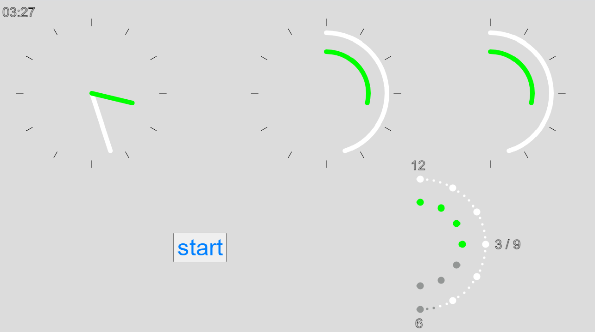
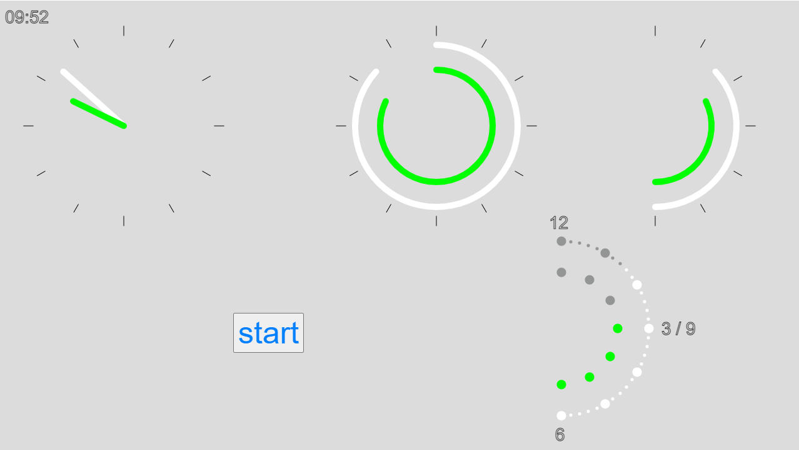

# Half-Dial
New clock/watch interface

It is a project to build minimalistic clock(watch) interface. It should be as readable as normal analog clock with two hands while occupying just half of 
regular clock space. If built in its digital form (with LEDs representing hours 
and minutes) it could be direclty controlled by ATmega328 chip.
To get impression hwo it works look at pictures. The top row on each pictures represents interface transformation starting from traditional two hands clock to 
half-dial clock. At the bottom row on the right you can see interface of digital 
clock with LEDs.

## Model
After cloning git project open with browser file "index.html" in the directory 
"p5model".

## Circuit Diagram
TODO

## C program
TODO
