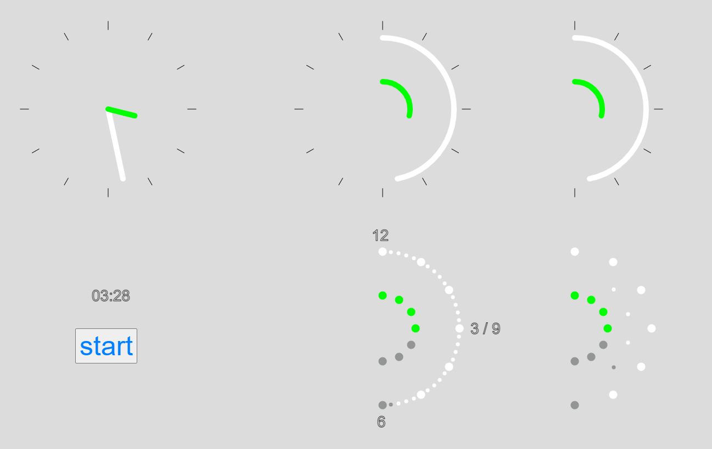

# Half-Dial
New clock/watch interface

It is a project to build minimalist clock(watch) interface. It should be as readable as normal analog clock with two hands, while occupying just half of 
regular clock space. If built in its digital form (with LEDs representing hours 
and minutes) it needs 38 LEDs and could be directly controlled by ATmega328 chip. It could be scaled down to 18 LEDs
without sacrificing  easiness to read time.
To get impression how it works look at pictures. The top row on each pictures represents interface transformation starting from traditional two hands clock to 
half-dial clock. At the bottom row on the right you can see interface of digital 
clock with LEDs and with minimal number of LEDs.

## Model
After cloning git project open with browser file "index.html" in the directory 
"p5model". Push the button "start" to initiate simulation. Push the "stop" to 
stop it.

## Circuit Diagram
TODO

## C program
TODO
